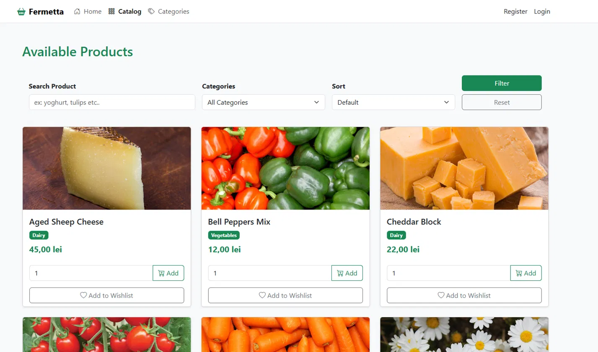
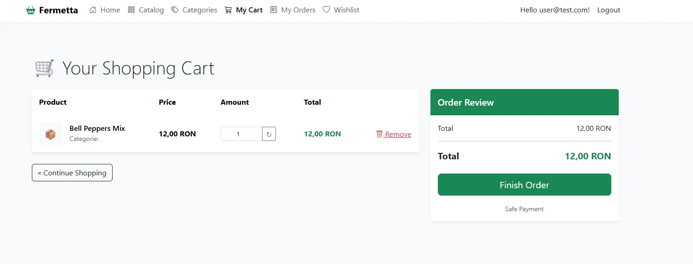
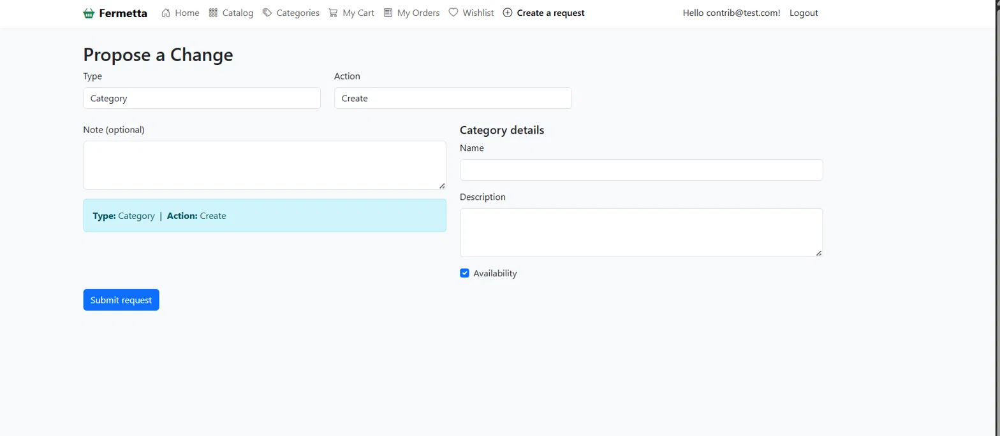
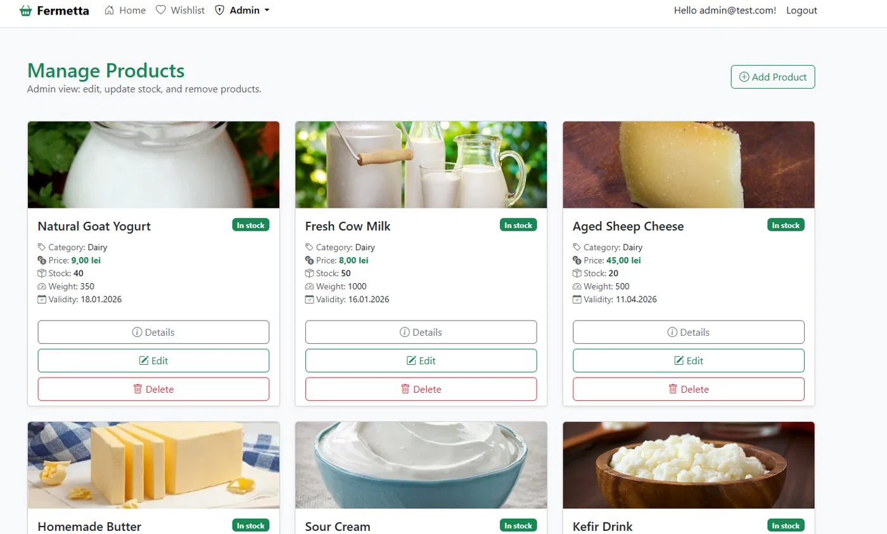
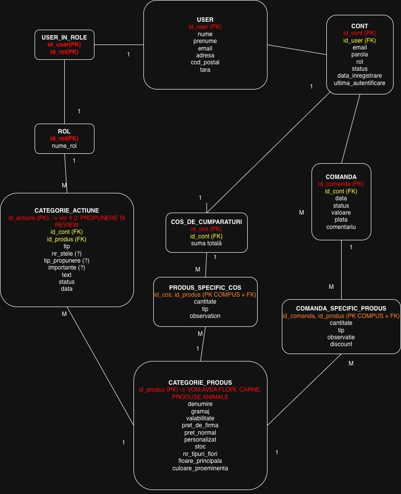

# Fermetta 🛒🌱


Fermetta is a feature-rich, collaborative e-commerce web application built with **ASP.NET Core MVC**. It goes beyond a traditional online store by introducing a community-driven catalog management system, allowing authorized "Contributors" to propose new products or edits, which are then reviewed by Administrators.



## ✨ Key Features

### 👤 User Roles & Authentication
The platform uses ASP.NET Core Identity with three primary roles:
* **Admin:** Full access to manage users, orders, products, categories, and review catalog change requests.
* **Contributor:** Can shop like a normal user but has the added ability to propose new products and categories or suggest updates to existing ones.
* **User:** Standard customer who can browse, add to cart, maintain a wishlist, place orders, and leave reviews.

### 🛍️ Shopping Experience
* **Dynamic Catalog:** Browse products by category, sort by price/rating, and search by keyword. Guests can browse freely; cart and wishlist actions route them through login and are **resumed automatically after sign-in**.
* **Shopping Cart & Checkout:** Intuitive cart management with quantity adjustments and stock validation. Secure checkout process with delivery details and payment methods (Cash/Card).
* **Wishlist:** Users can save their favorite products for later.
* **Order Tracking:** Customers can view their past orders and track their status (*New, In Process, Shipped, Cancelled*).



### 🤝 Community & Engagement
* **Product Reviews:** Customers can leave 1-5 star ratings and comments on products they've purchased (or viewed).
* **AI Product Assistant:** An integrated AI chat interface on product pages that answers specific customer queries about a product.

### 📝 Collaborative Catalog (Change Requests)
* **Proposals:** Contributors can fill out forms to suggest a new product/category or update an existing one.
* **Admin Review Pipeline:** Admins have an "Inbox" of pending requests. They can view the Contributor's proposal, edit it in an "Admin Draft" sandbox, and finally *Accept* or *Decline* the change, which automatically updates the live database.



### 🧑‍💼 Admin Tools
Admins manage the full catalog (products, categories, stock), user roles, and order statuses from dedicated management views.



## 🧪 Testing & CI

The shopping-cart business logic lives in a dedicated **service layer** (`CartService`), separated from the MVC controller so it can be tested in isolation. It is covered by **15 xUnit unit tests** (stock validation, quantity rules, per-account cart persistence, user isolation), running against an in-memory EF Core database.

Every push and pull request triggers a **GitHub Actions** workflow that builds the solution and runs the full test suite — the badge at the top of this page shows the current status.

```bash
dotnet test Fermetta/Fermetta.sln
```

## 🚀 Getting Started

### Run with Docker (recommended)

The repo ships with a multi-stage `Dockerfile` and a `docker-compose.yml` that starts the app together with SQL Server. Migrations and seed data are applied automatically on startup.

```bash
docker compose up --build
```

Then open **http://localhost:8080**. Seeded demo accounts: `admin@test.com`, `contrib@test.com`, `user@test.com`.

### Run locally

Requirements: .NET 9 SDK and SQL Server LocalDB (installed with Visual Studio).

```bash
cd Fermetta/Fermetta
dotnet run
```

The database is created, migrated and seeded on first run.

## 🗄️ Database

The relational model (users, roles, products, categories, carts, orders, wishlists, reviews, change requests):



## 🛠️ Tech Stack

* **Framework:** .NET 9 (C#) / ASP.NET Core MVC
* **Database ORM:** Entity Framework Core
* **Database:** SQL Server
* **Authentication:** ASP.NET Core Identity
* **Testing:** xUnit + EF Core InMemory, GitHub Actions CI
* **Containerization:** Docker & Docker Compose
* **Frontend UI:** Bootstrap 5, HTML5, CSS3, JavaScript
* **Icons:** Bootstrap Icons

## 👥 Team

Built by **Ștefan Rotaru** ([@BrutalArmy04](https://github.com/BrutalArmy04)) and **Maia Săpunaru** ([@maia-sapunaru](https://github.com/maia-sapunaru)) — developed in Scrum-style sprints with tasks tracked on a shared board.
